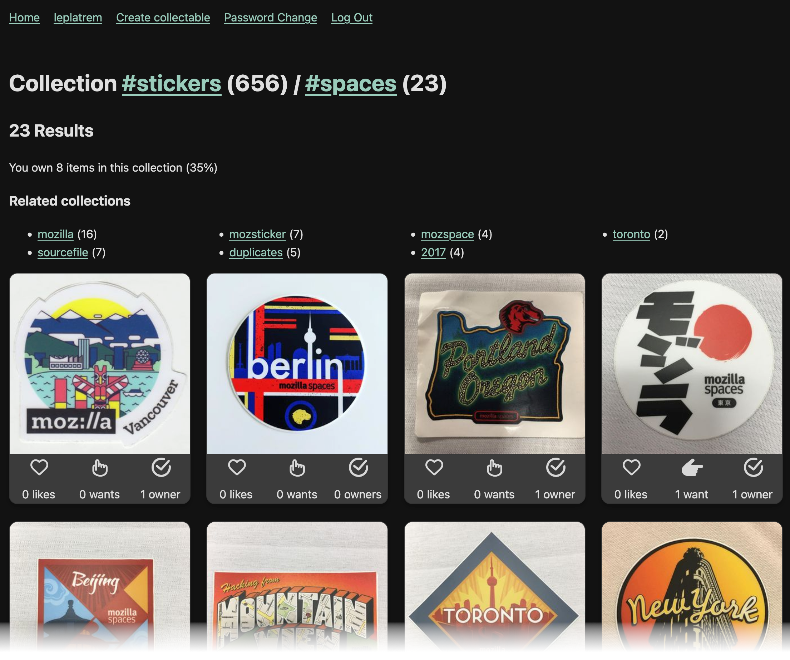

# Collect

Publish and track your collectables.

## Features

- Build collections using tags (eg. #stickers, #badges, #corp, #2024)
- Browse collections and sub-collections
- Track the items you own, like, or want
- Discover how much of the collections you own
- Turn folders of images files into collections (see below)



## Get started

### Run locally

| Using Docker          | From sources   |
|-----------------------|----------------|
| ``docker compose up`` | ``make start`` |

### Demo data

Creates ``admin`` and ``testuser`` users and a few collectables...

| Using Docker          | From sources   |
|-----------------------|----------------|
| ``docker run demo``   | ``make demo`` |

### Run tests

Unit tests

```
make test
```

or browser tests on `http://localhost:8000` using [Playwright](https://playwright.dev/):

```
make browser-tests
```

### Create users

Users can sign-up using a secret word. See ``SIGNUP_SECRETS_WORDS`` in your ``.env`` file.

In order to create an admin super-user:
```
uv run manage.py createsuperuser
```
You can then access to http://localhost:8000/admin/


### Import collectables from folder

Specify a `username` for the creator of the imported collectables, and a `folder` to import from.

The sub-folders will be used as tags, and additional tags can be specified.

If all collectables belong to the same owner, specify the username with `--owner`.

Example:
```
uv run manage.py loadfolder user ~/stickaz/ --owner=user --tags=tag1 --tags=tag2
```

The command can be executed multiple times with the same folder, and only new files will be added.

> Note: the `loadfolder` command relies on EXIF tags (`Date` of shot and camera `Model`) to uniquely
> identify pictures, so that files can be moved into folders and not be duplicated.


### Merge duplicates

Collectables reported as duplicates are merged automatically once enough users
have confirmed the report (see `COLLECT_DUPLICATE_CONFIRMATION_THRESHOLD`). To
merge the ones still waiting for confirmations:

```
uv run manage.py mergeduplicates
```

Merging hides the duplicate and moves its tags, description and possessions to
the original.


## Deploy

Settings are read from environment variables, falling back to the file pointed
at by `DOTENV_FILE` (`.env` by default). See `env.local` for an example.

Two settings are critical secrets:

- `DJANGO_SECRET_KEY`: session cookies and password reset tokens are signed
  with it.
- `COLLECT_SIGNUP_SECRETS_WORDS`: invitation secrets, which grant the
  permission to upload.

Recommended:

- `WEB_CONCURRENCY`: number of worker processes (2 x cores + 1).
- `DJANGO_REDIS_URL`: a shared cache.
- `DJANGO_CONN_MAX_AGE`: keeps database connections open across requests.
- `DJANGO_THROTTLE_NUM_PROXIES`: number of reverse proxies in front of the app,
  so that rate limits are keyed on the real client address (`1` with the
  configuration in `etc/apache/`).

Media files are served by the web server: see `etc/apache/` for recommended
headers settings.

Thumbnails are generated when a photo is uploaded. Generate missing ones with:

```
uv run manage.py generateimages
```

## License

* BSD 3-Clause License
